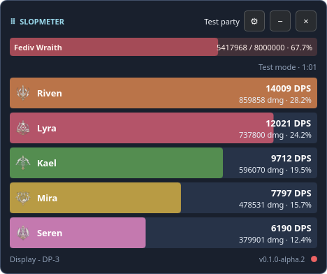
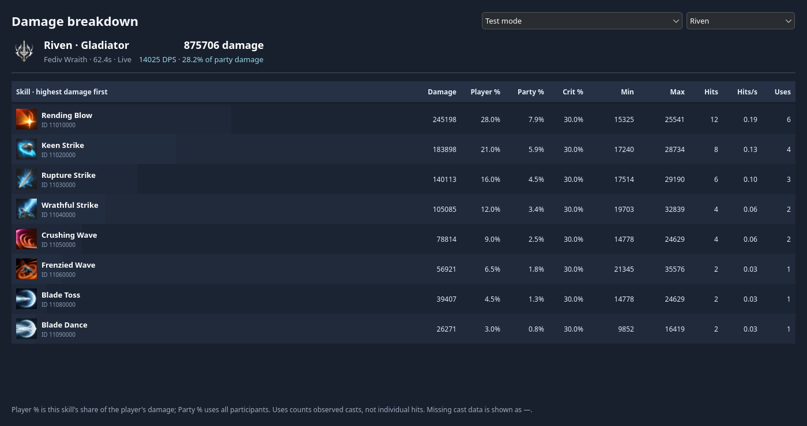

<h1 align="center">SLOPMETER</h1>
<p align="center">An AION 2 DPS meter for Linux and Wayland</p>
<p align="center"><strong>Alpha</strong> · <a href="https://github.com/Netskill89/slopmeter/releases">Download</a> · <a href="https://github.com/Netskill89/slopmeter/issues">Report an issue</a> · <a href="CONTRIBUTING.md">Contribute</a></p>

---

SlopMeter brings a native Linux overlay to AION 2 running through Steam/Proton.
It tracks your character and confirmed group members. Originally built to fill
a gap in Linux support, it may serve as a temporary alternative as support
from other DPS meter providers develops.

## Screenshots

<table>
  <tr><th>DPS overlay</th><th>Skill breakdown</th></tr>
  <tr>
    <td align="center"><a href="docs/images/boss-health-overlay.png"></a></td>
    <td align="center"><a href="docs/images/eight-skill-details.png"></a></td>
  </tr>
</table>

Click a screenshot to view it at full size.

## Features

- **Remembered character:** save a name in Settings or reuse the last detected name; fresh capture metadata verifies the current player.

- **Party DPS:** class icons, coloured player bars, and damage contribution.
- **Boss encounters:** captured boss health, area names and separate combat sessions.
- **Fight history:** the last 10 sessions, with per-player skill breakdowns and cast timelines.
- **Customisation:** bar styles, dimensions, spacing, opacity, score visibility, damage display, and refresh rate.
- **Test mode:** a five-player encounter with boss health and detailed skill data.

See [DPS calculation](docs/dps-calculation.md) for timing and decoding details.

## Installation

Download an **x86_64** build from [Releases](https://github.com/Netskill89/slopmeter/releases).
Both formats bundle the application libraries and capture helper.

| Format | Launch |
| --- | --- |
| **AppImage** | Make executable and run the downloaded file. |
| **tar.gz** | Extract the archive and run `AppRun` inside its folder. |

### AppImage

```sh
chmod +x SlopMeter-0.1.0-alpha.6-x86_64.AppImage
./SlopMeter-0.1.0-alpha.6-x86_64.AppImage --appimage-extract-and-run
```

The extraction option works on systems without FUSE. With FUSE available,
you can also double-click the executable AppImage.

### tar.gz

```sh
tar -xzf SlopMeter-0.1.0-alpha.6-x86_64.tar.gz
cd SlopMeter-0.1.0-alpha.6-x86_64
./AppRun
```

Run `./install.sh` to add an application-menu launcher. Keep the extracted
folder in place after installing the launcher.

### First launch

1. Launch SlopMeter as your normal desktop user.
2. Approve the desktop permission dialog if prompted to start packet capture.
3. Log into your AION 2 character. If the meter shows **Relog**, log out of the
   character and back in while SlopMeter is running.

Use the SlopMeter tray icon to show or hide the overlay and select a display.
If the icon is inside your desktop's hidden tray items, expand that menu. Launching
SlopMeter again restores the running meter. On desktops without a tray, hiding the
meter opens a small restore window in the taskbar. Open Settings
with the gear button; **Test mode** previews the layout with a complete encounter.

### Network capture

SlopMeter uses [nuriland/a2kit](https://github.com/nuriland/a2kit) to decode AION 2
network traffic, with [Wireshark’s dumpcap](https://www.wireshark.org/) providing
packet capture.

Under **Settings → Network capture**, choose Automatic, a specific network adapter,
or All interfaces. Click **Apply and restart capture** to activate the selection,
then relog your character. The selection is saved for future launches.

## Compatibility

### Verified environment

| Component | Tested configuration |
| --- | --- |
| Distribution | CachyOS |
| Desktop | KDE Plasma 6.7 |
| Display session | Wayland |
| CPU | AMD Ryzen 9 9950X |
| GPU | NVIDIA GeForce RTX 5070 Ti |
| Game runtime | Steam / Proton |

### Requirements

- An **x86_64 Linux** desktop with Wayland layer-shell support.
- Working graphics drivers and **Polkit (`pkexec`)** for capture authorization.
- **glibc 2.41+** for CI release builds; builds from newer systems may require a
  newer glibc.

Other distributions are **untested**. Automatic game-display detection uses KDE's
KWin integration; other supported desktops can select a display from the tray.
GNOME's default compositor does not provide the required layer-shell protocol.

### Alpha status

| Feature | Current support |
| --- | --- |
| Boss health | Current HP is read from network packets. Remaining HP percentage is shown when maximum HP is known. |

Boss health needs captured health updates and a boss identified by the bundled NPC
catalogue. Start capture before entering the area; re-enter or relog if spawn data
was missed. Area names appear when scene metadata is captured; unknown areas
are left unnamed. Confirmed boss sessions survive damage downtime and temporary
loss of visibility. Defeat, a full-health reset or a confirmed area transition
ends the session. Use **↻** between Settings and Minimise to reset damage
calculation manually; the interrupted fight is saved in history and capture
continues.
Ordinary enemies remain hidden. Elites and minibosses are shown only
when the catalogue classifies them as bosses; separate elite-rank detection is not
available yet. Game updates may require decoder fixes. Test mode uses simulated
data throughout.

## Updates

Download new versions from [Releases](https://github.com/Netskill89/slopmeter/releases)
and replace your installed copy with SlopMeter closed. Settings and fight history
are preserved.

**Planned:** automatic updates.

## Development

```sh
git clone https://github.com/Netskill89/slopmeter.git
cd slopmeter
bash scripts/build.sh
bash scripts/test.sh
./build/ui/slopmeter
```

See [Contributing](CONTRIBUTING.md) for build dependencies and pull-request
instructions, [Implementation notes](docs/technical.md) for architecture, and
[Release instructions](docs/releases.md) for CI and packaging.

## Acknowledgments

| Project | Used for |
| --- | --- |
| [a2kit](https://github.com/nuriland/a2kit) | AION 2 packet decoding and combat events |
| [Qt / Qt Quick](https://www.qt.io/) | QML interface and application windows |
| [LayerShellQt](https://invent.kde.org/plasma/layer-shell-qt) and [Wayland](https://wayland.freedesktop.org/) | Wayland overlay integration |
| [Wireshark](https://www.wireshark.org/) and [util-linux](https://github.com/util-linux/util-linux) | Packet capture and capture-helper privilege handling |
| [Aion2Flow](https://github.com/cloris-chan/Aion2Flow) | Protocol references, game data, and skill assets |

Dependency licenses and additional credits are listed in [Third-party notices](THIRD_PARTY.md).

## License

[GPL-3.0](LICENSE). See [Third-party notices](THIRD_PARTY.md) for dependencies and
game artwork. SlopMeter is not affiliated with NCSOFT.
